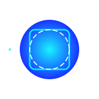
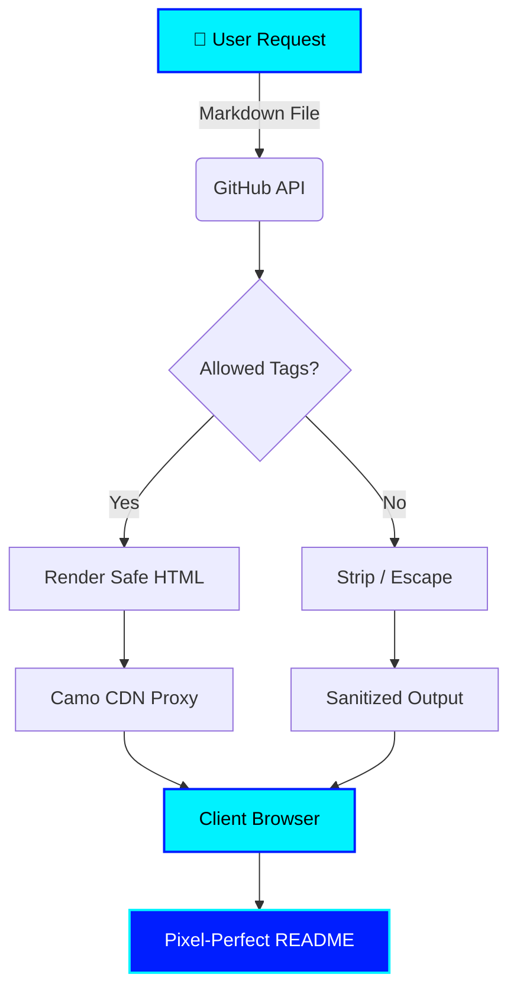
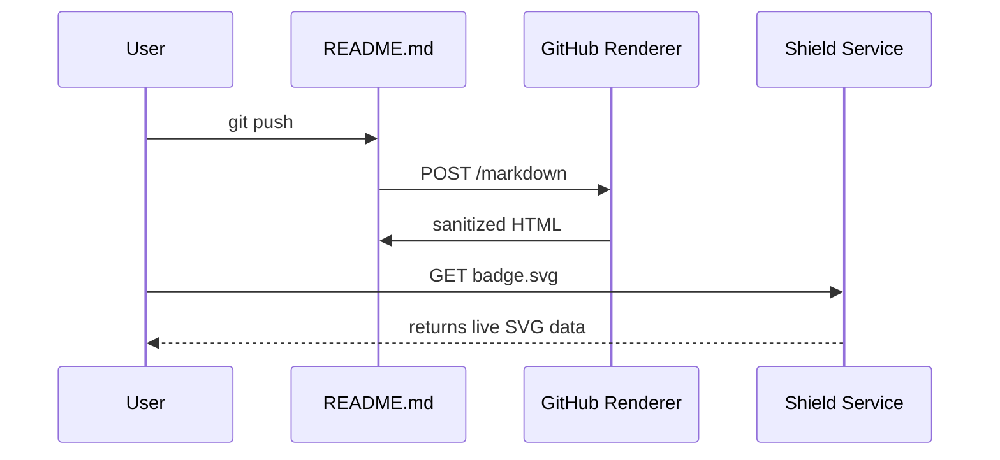
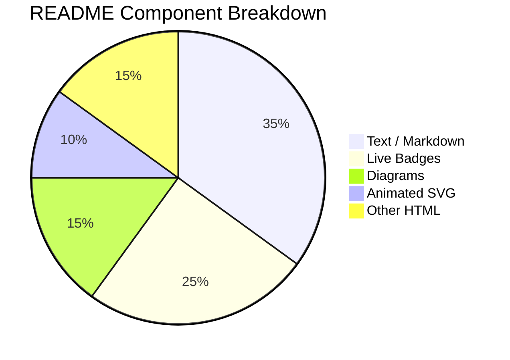

<!-- ╔═══════════════════════════════════════════════════════════════╗ -->
<!-- ║         GRAND SHOWCASE README  ·  Everything-at-Once          ║ -->
<!-- ╚═══════════════════════════════════════════════════════════════╝ -->

<!-- TYPING HEADER -->
<p align="center">
  
</p>

<!-- RESPONSIVE WAVING BANNER (Light / Dark aware) -->
<p align="center">
  <picture>
    <source media="(prefers-color-scheme: dark)" srcset="https://capsule-render.vercel.app/api?type=waving&color=0:001eff,100:00f2ff&height=200&section=header&text=GRAND%20SHOWCASE&fontColor=ffffff&fontSize=50&animation=twinkling">
    <source media="(prefers-color-scheme: light)" srcset="https://capsule-render.vercel.app/api?type=waving&color=0:00f2ff,100:001eff&height=200&section=header&text=GRAND%20SHOWCASE&fontColor=000000&fontSize=50&animation=twinkling">
    
  </picture>
</p>

<!-- BADGE SHIELD ROW -->
<p align="center">
  <a href="LICENSE"></a>
  
  
  
  
  
  <br>
  
  
</p>

---

<!-- TABLE OF CONTENTS -->
## 📑 Navigation

- [⚡ Alerts & Callouts](#alerts--callouts)
- [🖼️ Visual Systems](#visual-systems)
- [📊 Live Data & Badges](#live-data--badges)
- [🏗️ Architecture (Mermaid)](#architecture-mermaid)
- [🧮 Math & Science](#math--science)
- [📋 Specifications Table](#specifications-table)
- [⌨️ Interactions (Details, KBD, Tasks)](#interactions-details-kbd-tasks)
- [🗺️ Geographic Data](#geographic-data)
- [💻 Code Showcase](#code-showcase)
- [🔖 References & Footnotes](#references--footnotes)
- [🤝 Credits](#credits)

---

## ⚡ Alerts & Callouts

> [!NOTE]
> This is an informational `!NOTE` callout. Use it for sidebars and trivia.

> [!TIP]
> This is a `!TIP`. Use it for shortcuts like pressing <kbd>Ctrl</kbd> + <kbd>Shift</kbd> + <kbd>P</kbd> to open the command palette.

> [!IMPORTANT]
> This is an `!IMPORTANT` block. It highlights hard requirements you cannot skip.

> [!WARNING]
> This is a `!WARNING`. Proceed with caution before pushing destructive changes.

> [!CAUTION]
> This is a `!CAUTION`. It warns of irreversible or risky actions.

---

## 🖼️ Visual Systems

### Responsive Light / Dark Mode Image
GitHub respects the viewer's OS theme automatically using `<picture>`:

<picture>
  <source media="(prefers-color-scheme: dark)" srcset="https://placehold.co/800x200/0D1117/00F2FF?text=DARK+MODE+SYSTEM+ENGAGED&font=roboto">
  <source media="(prefers-color-scheme: light)" srcset="https://placehold.co/800x200/F0F0F0/001EFF?text=LIGHT+MODE+SYSTEM+ENGAGED&font=roboto">
  
</picture>

### Animated SVG (SMIL — no JavaScript)
This SVG is committed as a real file in this repo and referenced via ``. Because it is loaded as an *image asset* (not inline HTML), GitHub preserves the SMIL animation:

<p align="center">
  
</p>

### Inline HTML sizing & alignment
Markdown cannot resize or float images. Raw HTML can:


<span>This text wraps around an image aligned with raw <code>align="left"</code>. You can also combine <kbd>width</kbd>, <kbd>height</kbd>, and <kbd>alt</kbd> for precise control. Chemistry example: H<sub>2</sub>O and E = mc<sup>2</sup> (we'll do the proper math rendering below).</span>

<br clear="all">

---

## 📊 Live Data & Badges

These are **not screenshots**. They are live-generated SVG images returned by external services.

<p align="center">
  
  
</p>

<p align="center">
  
</p>

<p align="center">
  
</p>

<p align="center">
  
</p>

> [!IMPORTANT]
> Replace <b><code>YOUR_GITHUB_USERNAME</code></b> everywhere above to activate your stats. For the <b>fork/stars</b> shields and <b>contrib.rocks</b> below, also replace <b><code>YOUR_REPO_NAME</code></b>.

---

## 🏗️ Architecture (Mermaid)

Rendered natively by GitHub — no external service required.







---

## 🧮 Math & Science

LaTeX-style math is rendered natively on GitHub.

Inline equation: $E = mc^2$

Block equation:
$$\oint_{\partial \Omega} \mathbf{E} \cdot d\mathbf{A} = \frac{Q_{\Omega}}{\varepsilon_0}$$

Infinite series:
$$\sum_{n=1}^{\infty} \frac{1}{n^2} = \frac{\pi^2}{6}$$

Chemical notation with sub/sup (non-LaTeX):  
CO<sub>2</sub> + H<sub>2</sub>O → H<sub>2</sub>CO<sub>3</sub>

---

## 📋 Specifications Table

| Feature | Status | Details | Priority |
|:--------|:------:|--------:|---------:|
| **GitHub Alerts** (`!NOTE`, etc.) | ✅ Native | 5 variants available | High |
| **Light / Dark Images** | ✅ Native | `<picture>` + `prefers-color-scheme` | High |
| **Animated SVG** | ✅ SMIL only | Must be referenced via `` file link | Medium |
| **JavaScript / `<script>`** | ❌ Blocked | Sanitized by GitHub CSP | — |
| **External Badges** | ✅ Live SVG | shields.io, stats APIs, trophy services | High |
| **Task Lists** | ⚠️ Static | Interactive only in Issues / PRs | Low |
| **Emoji Shortcodes** | ✅ Native | `:rocket:` renders as 🚀 | High |
| **Mermaid Diagrams** | ✅ Native | Flowcharts, sequence, pie, Gantt, class, ER | High |
| **LaTeX Math** | ✅ Native | Inline and block equations | High |
| **GeoJSON Maps** | ✅ Native | Interactive Leaflet map embed | Medium |
| **Diff Code Blocks** | ✅ Native | Red/green syntax highlighting | Medium |
| **HTML (safe subset)** | ✅ Partial | `align`, `width`, `<kbd>`, `<details>`, etc. | Medium |
| **Footnotes** | ✅ Native | `[^1]` reference syntax | Low |

---

## ⌨️ Interactions: Details, KBD & Tasks

Execute the quick-start command by pressing <kbd>Ctrl</kbd> + <kbd>Alt</kbd> + <kbd>T</kbd>, then type:

```bash
git commit -m "feat: implement grand showcase" && git push
```

Then press <kbd>Enter</kbd>.

### Collapsible implementation guides

<details>
<summary>🔧 Click to expand: How the Light/Dark toggle works</summary>

1. Create two themed asset versions (light + dark).
2. Use the `<picture>` HTML element:
   ```html
   <picture>
     <source media="(prefers-color-scheme: dark)" srcset="dark.png">
     <source media="(prefers-color-scheme: light)" srcset="light.png">
     
   </picture>
   ```
3. Commit and push — GitHub respects the viewer's OS/browser theme.

> [!TIP]
> For a Markdown-only shortcut, append `#gh-dark-mode-only` or `#gh-light-mode-only` to an image URL.

</details>

<details>
<summary>📋 Click to expand: Project Roadmap (Task List)</summary>

- [x] Design architecture diagram (Mermaid)
- [x] Implement responsive banner system
- [x] Integrate live stat badges
- [x] Add LaTeX math support
- [x] Embed GeoJSON map
- [ ] Write automated GitHub Action updater (see Bonus below)
- [ ] Reach **1,000** ⭐ stars

</details>

<details>
<summary>📦 Click to expand: File Structure of this Showcase</summary>

```
fun/
├── README.md                     ← This file
├── assets/
│   └── animated-sphere.svg       ← SMIL-animated SVG (plays on GitHub)
└── .github/workflows/
    └── (optional) auto-update.yml
```

</details>

---

## 🗺️ Geographic Data

GitHub natively renders GeoJSON from fenced code blocks as an **interactive map**.

```geojson
{
  "type": "FeatureCollection",
  "features": [
    {
      "type": "Feature",
      "properties": {
        "marker-size": "medium",
        "marker-color": "#00f2ff",
        "marker-symbol": "star",
        "name": "Showcase Origin"
      },
      "geometry": {
        "type": "Point",
        "coordinates": [ -0.1276, 51.5074 ]
      }
    }
  ]
}
```

---

## 💻 Code Showcase

**Python implementation:**
```python
def grand_showcase(features: list[str]) -> None:
    """Render the ultimate README."""
    for feat in features:
        print(f"✨ Loaded module: {feat}")

grand_showcase(["Markdown", "HTML", "SMIL-SVG", "Mermaid", "LaTeX", "GeoJSON"])
```

**Diff view:**
```diff
- const oldWay = true;
+ const bestPractice = "write safe Markdown!";
#  Hint: Always sanitize user inputs.
```

**Console output:**
```bash
$ python grand_showcase.py
✨ Loaded module: Markdown
✨ Loaded module: HTML
✨ Loaded module: SMIL-SVG
✨ Loaded module: Mermaid
✨ Loaded module: LaTeX
✨ Loaded module: GeoJSON
Done.
```

---

## 🔖 References & Footnotes

Every capability demonstrated here is documented in the official GitHub docs[^1].  
The visitor counter uses a privacy-friendly image beacon[^2].  
Mermaid syntax references are available on the official site[^3].  
Capsule-render generates the animated header banner[^4].

Jump back to [📑 Navigation](#navigation) or forward to [🤝 Credits](#credits).

[^1]: [GitHub Docs — Basic writing and formatting](https://docs.github.com/en/get-started/writing-on-github/getting-started-with-writing-and-formatting-on-github)
[^2]: [komarev.com/ghpvc](https://komarev.com/ghpvc) — hit counter service.
[^3]: [Mermaid Diagram Syntax](https://mermaid.js.org/intro/)
[^4]: [Capsule Render](https://github.com/kyechan99/capsule-render) — generate dynamic header banners.

---

## 🤝 Credits

<p align="center">
  <a href="https://github.com/Ammar-create/Lokiodinson.netlify.app/graphs/contributors">
    
  </a>
</p>

<p align="center">
  <b>Built with 💙 using Markdown, HTML, SMIL SVG, Mermaid, and too much caffeine.</b><br>
  <sub>Last updated manually — <a href="#bonus-auto-update-workflow">automate it below</a>!</sub>
</p>

<!-- ═══════════════════════════════════════════════════════════════ -->
<!-- BONUS: GitHub Action Workflow -->
<!-- ═══════════════════════════════════════════════════════════════ -->

<details>
<summary>🤖 Bonus: Auto-Update Workflow (click to reveal YAML)</summary>

```yaml
name: README Maintenance
on:
  schedule: [{ cron: "0 */6 * * *" }]   # Every 6 hours
  workflow_dispatch:
jobs:
  update:
    runs-on: ubuntu-latest
    permissions:
      contents: write
    steps:
      - uses: actions/checkout@v4
      - run: |
          sed -i "s/Last updated manually.*/Last updated: $(date -u +%Y-%m-%d %H:%M UTC)/" README.md
      - run: |
          git config user.name "github-actions[bot]"
          git config user.email "41898282+github-actions[bot]@users.noreply.github.com"
          git add README.md
          git commit -m "chore: auto-update README timestamp" || echo "No changes"
          git push
```

</details>
